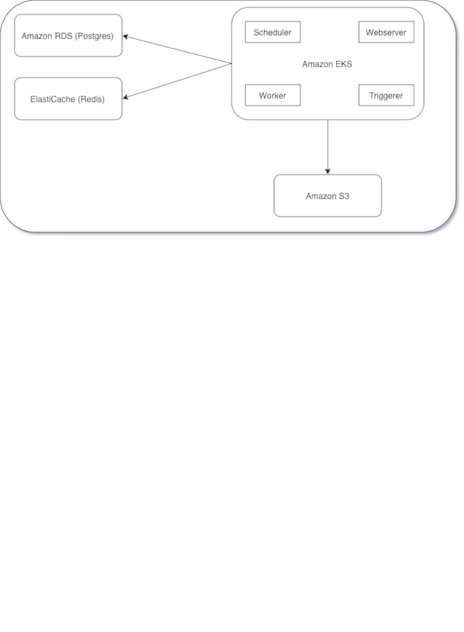

# Arquitetura AWS para Sistema de Integração de Dados com Airflow, Postgres e Redis Usando Kubernetes

Componentes Principais

## Amazon RDS (Postgres)

Banco de dados gerenciado para armazenamento de metadados do Airflow.

# Amazon ElastiCache (Redis)

Serviço gerenciado de cache para o broker de mensagens do Celery Executor.

# Amazon EKS (Elastic Kubernetes Service)

Para orquestração e execução dos contêineres do Airflow (Webserver, Scheduler, Worker, Triggerer, e Flower).

## Amazon S3

Para armazenamento de logs e arquivos de dados dos DAGs.

# Diagrama de Arquitetura

# Versão cloud proposta

## Detalhamento dos Componentes

### Amazon RDS (Postgres)

Será utilizado o Amazon RDS para criar uma instância gerenciada do Postgres. Alta disponibilidade com Multi-AZ, e escalabilidade vertical conforme necessário.

### Amazon ElastiCache (Redis)

Será utilizado o ElastiCache para Redis.

### Amazon EKS (Elastic Kubernetes Service)

Um cluster EKS para gerenciar os contêineres, o que nos permitirá escalar sob demanda e utilizando de forma racional os recursos. Serão definidos deployments para cada item do Airflow: Webserver, Scheduler, Worker, Triggerer e Flower.
Utilizar o kubernetes para orquestrar toda a solução nos permitirá focar na execução da plataforma de dados.

### Amazon S3

As DAGs e outros arquivos de dados serão armazenados no Amazon S3. Serão criados buckets com políticas de acesso apropriadas para cada caso de uso.

## Descrição da implementação

1. Configurar RDS e ElastiCache
2. Criar e aplicar as politicas necessárias no(s) bucket(s)
3. Criação do cluster EKS
- Hardening do cluster para aplicação das politicas necessárias
- Criação dos recursos necessários do airflow
- Criação dos controllers para ativação dos acessos externos (Ingress)
4. Upload das dags para o S3 e configuração do Airflow para observar os dados nos buckets
5. Configurações de integrações necessárias para permitir o acesso dos usuários a plataforma
6. Monitoramento dos itens para garantir a saúde da plataforma